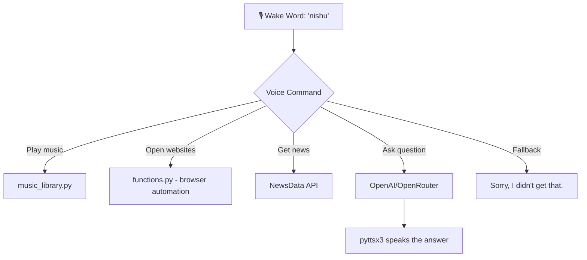

# 🤖 Nishu - AI Voice Assistant

Say hello to **Nishu** – your personal AI voice assistant, built with 💬 Python and powered by cutting-edge AI. It talks, listens, performs tasks, and even answers random questions, all through voice. No GUI needed — just speak and vibe.

---

## 🧠 Features

- 🎙️ **Voice Activation** with wake word detection ("nishu")
- 💬 **Conversational AI** (powered by OpenAI or OpenRouter models)
- 🌐 **Online Search & Responses**
- 🎵 **Music Playback** from your local library
- 📰 **Latest News** using NewsData.io API
- 🌍 **Open Websites** like YouTube, Google, WhatsApp, etc.
- 💬 **Jokes, Fun Facts**, and more
- 📡 Fully offline-compatible except for AI/chat tasks

---

## 🛠️ Tech Stack

- **Python 3.10+**
- All dependencies listed in [`requirements.txt`](./requirements.txt)

---

## 🗂️ Project Structure

```
📁 Nishu-AI_Voice_Assistant/
├── main.py             # Main script to run assistant
├── functions.py        # Modular functions for tasks
├── music_library.py    # Custom music player
├── sample_api.py       # Test different models/APIs
├── requirements.txt    # All dependencies
└── .gitignore          # Clean repo
```

---

## 🚀 How to Run

```bash
# Clone the repo
git clone https://github.com/dhrumilshah-216/Nishu-AI_Voice_Assistant.git
cd Nishu-AI_Voice_Assistant

# Install all required dependencies
pip install -r requirements.txt

# ⚠️ Before you run:
# 1. Replace sample_api.py with your own api.py file.
# 2. In api.py, store your API keys (like OpenAI or OpenRouter) in variables that are used inside the project.
# 3. Make sure the keys and model names match those in main.py

# Now run the assistant
python main.py
```

---

## 🔁 Workflow



---

## 🙋 About Me

**Dhrumil Shah**  
🧠 Tech Explorer | 🎓 AIML Student  
🔗 [LinkedIn](https://www.linkedin.com/in/dhrumil-shah-646815350)

---

## 🙏 Credits

- 🔊 Voice recognition: `SpeechRecognition`  
- 🎤 Text-to-speech: `pyttsx3`  
- 🤖 AI Responses: `OpenAI` or `OpenRouter`  
- 📰 News API: `NewsData.io`

---

## ⚙️ Inspired by

Real-world assistants like **JARVIS**, but reimagined in Python.
